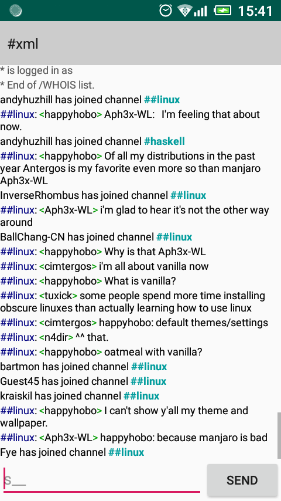
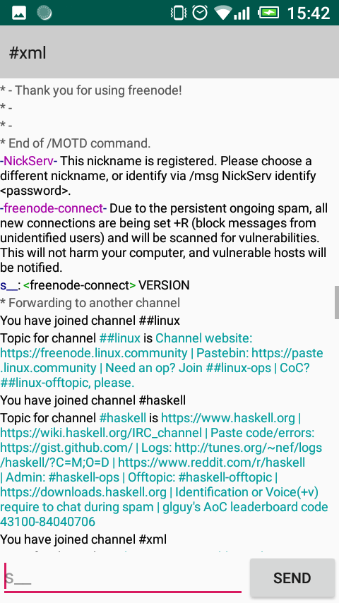

# irc1java
Android IRC client, made with Android Studio 3.2.1

## Features
- Connect to IRC server of your choice.
- Automatically join channels, execute scripts.
- Switch between multiple channels in the same window.
- Syntax highlighting.
- User-friendly notice messages from server.
- Persistent socket connection in background thread.

 

## Credits
USTH Students.
